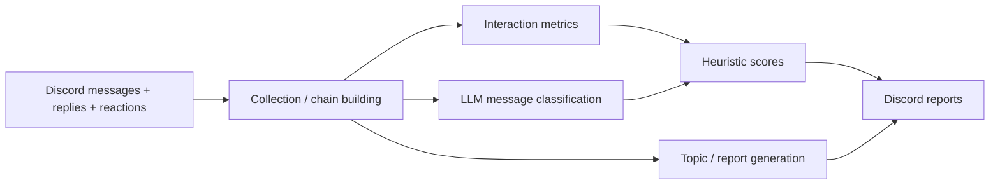

# Discord Collaboration Analytics Prototype

This repository contains a hackathon/submission prototype for analysing **Discord collaboration patterns**. The bot collects recent server messages, reply chains and reactions, computes simple interaction metrics, uses an LLM to classify message tone/cooperation, and generates server/user summaries through Discord UI commands.

> **Status:** exploratory social-analytics prototype. The derived “influence”, “contribution spirit”, cooperation/competition and similar scores are hand-designed heuristics and LLM judgements. They are **not validated measures of employee performance, personality, leadership, teamwork quality, or intent**.

## What is implemented

- Discord bot event handling and slash/command UI;
- recent-message collection across accessible channels;
- reply-chain and conversation-chain reconstruction;
- reaction aggregation;
- grouping of consecutive messages;
- heuristic influence scoring from messages/replies/reactions;
- LLM classification of messages as cooperative / competitive / neutral;
- topic extraction and weekly-report generation;
- JSON backup/restore for in-memory state.

## Key components

The project is currently concentrated in [`bot.py`](bot.py). Its main responsibilities are:

- Discord ingestion/event handlers;
- conversation/reply-chain construction;
- `calculate_influence_scores()`;
- `classify_message_with_gpt()` and downstream contribution scoring;
- report/topic generation;
- backup/restore behavior.

This single-file structure reflects submission speed rather than a preferred architecture.

## Data flow



## Local setup

```bash
python -m venv .venv
# Windows: .venv\Scripts\activate
# Unix/macOS: source .venv/bin/activate
pip install -r requirements.txt
cp .env.example .env
python bot.py
```

The original code expects bot/model credentials from `.env`. Runtime backups are generated under `backups/` and should not be committed because they can contain message content and user identifiers.

## Important limitations

- **Privacy:** the bot can read and persist server message content. Any real deployment requires explicit server/user expectations, data minimisation, retention/deletion rules and access controls.
- **Scoring validity:** message volume, reactions and reply depth are not reliable standalone measures of influence or contribution quality.
- **LLM judgement:** a zero-temperature prompt returning “cooperative”, “competitive” or “neutral” is still an uncalibrated model judgement and may be contextually wrong.
- **Cultural/context bias:** tone and collaboration cannot be inferred reliably from isolated text across communities, languages and communication styles.
- **Fallback behavior:** model errors currently collapse to a neutral classification, which hides uncertainty.
- **Architecture:** state, Discord I/O, analytics and model calls live in one large module and should be separated before serious reuse.
- **Persistence:** JSON snapshots are convenient for a demo but not robust concurrent storage.

## Future work

A better direction would be to shift the system from person-ranking toward **descriptive, opt-in team analytics**: show conversation/topic patterns and uncertainty rather than scoring people. Technically, the next steps would be to split Discord ingestion, normalized event storage, analytics and report generation; schema-validate all model outputs; retain model errors as explicit unknowns; add synthetic Discord fixtures; and test scoring/report invariants without requiring the Discord or model APIs.
